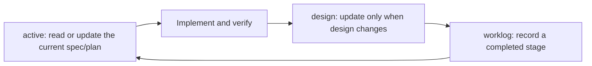

# Composable Agent Workflow

English | [中文](agent-workflow.zh-CN.md)

This document defines a public, composable workflow for coding agents. It separates a small broadly applicable core from user-selected host and workspace modules. It is a decision framework, not a demand for hidden chain-of-thought or a ritual delay before every answer.

## Outcomes

- Preserve the user's real goal, authorization, and acceptance surface.
- Produce the simplest complete solution with evidence, not the fastest plausible reply.
- Keep the shared core small enough to remain useful across languages, hosts, tools, and development domains.
- Add language, tool, host, experiment, documentation, or domain behavior only when the user chooses the relevant module after understanding its effect and cost.

## Reasoning Preflight

Before a non-trivial action, answer these questions internally:

1. What outcome is the user actually trying to obtain, and how will it be observed?
2. Which facts are verified, which conclusions are reasonable inferences, and which assumptions remain unverified?
3. Does the request contain a weak premise, missing decision, hidden risk, or a cheaper equivalent path?
4. From first principles, which constraints and invariants are truly necessary?
5. By Occam's razor, what solution meets them with the fewest states, dependencies, and maintenance obligations?
6. Through Socratic challenge, what counterexample, failure mode, or alternative would change the decision?

Ask the user only when an unresolved answer materially changes architecture, data, permissions, security, compatibility, user-visible behavior, or authorization. Otherwise inspect the available evidence, state a low-risk assumption when useful, and continue.

“Pause before answering” should become this internal preflight, not fixed waiting time or a verbose reasoning transcript.

## Instruction Layers

Use each layer for one kind of information:

- Global `~/.codex/AGENTS.md`: the minimal core plus only the stable language, reporting, tool, platform, and host modules selected for that machine.
- Repository or nested `AGENTS.md`: durable team and codebase rules, commands, boundaries, and paths to `active/`, `design/`, and `worklog/`.
- Project `docs/`: current specs and plans in `active/`, stable algorithm and technical design in `design/`, and completed-stage records in `worklog/`.
- Skills: repeatable procedures that benefit from richer instructions, scripts, references, assets, or checks.
- Memories and session indexes: private local context. Curate or index them; do not copy raw histories into public repositories.

Keep `AGENTS.md` small. Put a rule there when it is stable and repeatedly applicable, not merely because it mattered once. Codex's official customization guidance describes `AGENTS.md`, memories, Skills, MCP, and subagents as complementary layers rather than substitutes: <https://learn.chatgpt.com/docs/customization/overview>.

An always-loaded rule earns its instruction budget only when it is stable at that scope, hard or costly to rediscover, relevant to nearly every task there, and consequential when missed. Treat `/init` and other generated `AGENTS.md` output as candidate inventory, not a finished instruction file: remove or rehome repository maps, current file or service locations, implementation details, progress, one-off corrections, and language or domain procedures that code search, manifests, nested `AGENTS.md`, project documentation, or a Skill can disclose when needed. Audit existing rules with the same admission test instead of preserving every non-conflicting line. See the official [AGENTS.md discovery rules](https://learn.chatgpt.com/docs/agent-configuration/agents-md) and the practical [progressive-disclosure guide](https://www.aihero.dev/a-complete-guide-to-agents-md).

### Treat session location as a hint

When maintaining a private session archive, do not assign project ownership from `cwd` alone. Combine the working directory with the relevant Git root, touched paths or artifacts, the user's stated objective, and whether the record is a root thread, fork, or subagent. A session may span projects or belong to personal operations, and copied subagent context is not evidence that every referenced project was actually changed. Keep the raw mapping private and publish only curated lessons that remain useful across projects.

## Two Independent Deployment Paths

| Deployment | Owns | Must not own |
| --- | --- | --- |
| Host-global `AGENTS.md` | Minimal shared behavior and explicitly selected host preferences | Project state, project paths, session history, domain rules |
| Workspace modules | Selected project workflows such as continuous docs, experiment records, or robotics evidence | Personal communication defaults and host-specific shell or tool rules |

Each path must remain useful on its own and must have its own preview, approval, update, and removal process. Using both is recommended because they solve complementary problems. Do not implement the recommendation by copying rules between layers: global instructions govern behavior; project instructions tell agents where to find current plans, design, and work records.

For the meaning, cost, and selection boundary of host rules, see [Host-Global AGENTS Rule Reference](global-agents.md). For the optional three-directory project flow, see [Workspace Continuous Documentation Workflow](workspace-continuous-documentation.md).

### Select modules instead of inheriting them

The cross-platform core does not carry personal language, worktree, subagent, RTK, time-zone, operating-system, resource, or domain policy. During installation, the agent inspects the host and existing rules, filters out irrelevant modules, and explains the remaining choices before the user selects them.

- Runtime detection establishes relevance, not approval. For example, Windows native makes `templates/platform/windows-shell.md` a sensible recommendation, but the module is merged only after the user confirms the diff.
- Do not ask the user about clearly irrelevant modules. A robotics module does not belong in a general web workspace merely because the host also contains robotics repositories.
- Do not infer one option from another. Selecting Chinese does not select RTK; selecting continuous documentation does not select experiment or robotics rules.
- A selected module must appear exactly once, and parameterized modules such as time zone must not retain unresolved placeholders.

Machine paths, version snapshots, credentials, session state, and host inventories do not belong in public modules.

## Core and Optional Defaults

The minimal core keeps only behavior that remains useful across most development settings: independent judgment, authorization and secret boundaries, focused implementation, evidence-driven debugging, compatibility decisions, proportional verification, and candid reporting.

The following are explicit choices rather than universal defaults:

- conversation language and treatment of English technical identifiers;
- single-agent operation and subagent context limits;
- staying in one checkout instead of using Git worktrees;
- optional `rtk` filtering;
- a recorded time zone;
- detailed Git repository or persistent-data safeguards;
- platform shell behavior and host resource limits; and
- continuous documentation, experiment discipline, and robotics validation inside a workspace.

The option catalog is in [templates/optional/](../templates/optional/), platform-specific choices are in [templates/platform/](../templates/platform/), and project choices are in [templates/workspace/](../templates/workspace/). The deployment agent should recommend a small relevant set, explain behavior and tradeoffs in plain language, and obtain approval through the proposed diff.

## Compatibility Is a Decision

Do not preserve or remove backward compatibility by reflex.

| Context | Default direction | Decision evidence |
| --- | --- | --- |
| Personal research, prototype, unpublished experiment | Prefer direct migration and removal of obsolete paths | Active consumers, reproducibility needs, rollback cost |
| Shared lab infrastructure, multi-user tooling, public package, industrial or production system | Prefer a bounded compatibility or migration plan | Supported versions, downstream users, deprecation window, rollback and observability |
| Context is unclear or the choice changes architecture or user behavior | Ask the developer | Exact consumers, required contract, acceptable breakage |

When compatibility is required, prefer an explicit version boundary, migration path, and removal condition over permanent fallbacks and silent dual behavior.

## Implementation Discipline

- Choose the simplest implementation that fully meets the current requirement. “Simple” means fewer states, dependencies, failure modes, and maintenance obligations—not merely the smallest diff.
- Implement the requested behavior without adding adjacent features, future extension points, or explanatory scaffolding. When unrequested work is removed, remove its narrative residue too: names, comments, tests, commits, and pull-request summaries should describe the delivered behavior, not advertise unrelated omissions.
- Use file length, cyclomatic complexity, nesting depth, and dependency count as review signals rather than universal gates. A project-owned limit may be enforced, but do not create a global threshold that merely pushes one responsibility into more files or wrappers.
- Do not add hashes, frozen contracts, baselines, gates, shadow state, or bespoke validation by default. First name the concrete failure they prevent and why Git, versioning, primary keys, transactions, uniqueness, types, or ordinary targeted tests are insufficient. Preserve existing safeguards and use stricter controls at authentication, data-safety, irreversible-operation, release, and other demonstrated high-risk boundaries.
- For a non-obvious problem, use evidence to locate the broken responsibility, constraint, invariant, or data flow before choosing a fix. Restore the correct model with the smallest precise change; do not preserve a tiny diff by stacking temporary patches.
- Grow working systems in verified layers. Each layer should run end to end before the next capability is added.
- Keep concerns separated, but do not add speculative abstractions, configuration, or extension points.
- Preserve unrelated work and touch only files traceable to the request or a necessary induced fix.
- Keep production code free of debug artifacts, dead code, stale branches, and temporary files created by the task.
- Prefer long-lived architectural choices, but do not build an imagined future before the present acceptance criteria are met.

## Risk-Proportional Three-Angle Verification

Seek evidence from three complementary angles after code or configuration changes:

1. Expected behavior: the intended path works on the real acceptance surface.
2. Boundary behavior: a relevant edge, failure, or regression path is covered.
3. Independent evidence: tests, static analysis, diff/config inspection, logs, build output, or real-interface review corroborates the result.

Three-angle verification must not obstruct agile development. It does not require three test suites or full CI after every one-variable edit:

- Low-risk local change: one fast targeted check may cover several angles; add a diff/config review.
- Medium-risk change: run directly related tests plus one boundary or static check.
- Core flow, shared module, permission, security, data, or user-interface change: expand to the real interface, integration path, and rollback behavior.

Do not run low-signal checks merely to reach a count of three. If an angle is unavailable or inapplicable, say why. If the same issue survives three meaningful fix-and-verification attempts, stop changing code and review the architecture, data flow, dependencies, and failure boundary.

## Optional Three-Directory Workspace Documentation

When a workspace owner selects continuous documentation because a project needs continuity across sessions, maintain only three kinds of documents:

- `docs/active/` contains current specs or plans with goals, scope, acceptance criteria, progress, and next steps.
- `docs/design/` contains long-lived algorithm, interface, architecture, and safety design, not daily progress.
- `docs/worklog/` uses one template to record a completed stage's background, work, results, evidence, problems, and next steps rather than a command transcript.
- Read the relevant active document before substantial work and related design documents before changing algorithms or interfaces. Small edits do not require a plan or worklog.
- At task completion, leave the workspace restartable without the prior session: preserve long-lived design in `design/`, actual results in `worklog/`, and any unfinished next step in `active/`; when the plan is complete, move it out of `active/`. Reuse an existing archive if present; do not create one just for this workflow.
- Project `AGENTS.md` stores only stable rules and paths to these folders, not current progress.
- Never delete pre-existing user documents or history without authorization; clean up only task-created scratch whose useful information has already been retained.

## Packaging Gate

Do not create a Skill merely because a workflow can be written as one. Package it only when:

- the trigger and expected output are stable;
- the process repeats across tasks or projects;
- progressive disclosure is useful;
- scripts, references, assets, or automated checks add real value; and
- installation, updates, and generated state do not cost more than the workflow saves.

A meta-skill or Skill framework may help with authoring and evaluation, but its own benchmark is only candidate evidence. Review its code, dependencies, generated files, context footprint, and reproducibility before installation.

## Updating This Workflow

Change stable rules after repeated feedback, a corrected assumption, a recurring failure, or a verified tool/platform change. Put broadly applicable behavior in the core; put user, tool, host, platform, and domain choices in named modules. Keep one-off preferences and machine state out of the public guide. Update the English and Chinese versions together when their meaning changes.
