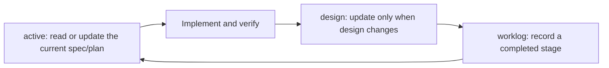

# Personal Agent Workflow

English | [中文](agent-workflow.zh-CN.md)

This document defines public, cross-project defaults for coding agents. It is a decision framework, not a demand for hidden chain-of-thought or a ritual delay before every answer. The agent should judge before acting, then report conclusions, evidence, and unverified boundaries concisely.

## Outcomes

- Preserve the user's real goal, authorization, and acceptance surface.
- Produce the simplest complete solution with evidence, not the fastest plausible reply.
- Keep projects resumable: current work in `active/`, long-lived design in `design/`, and completed records in `worklog/`.
- Use tools, Skills, subagents, and compatibility layers only when their benefit exceeds their context, maintenance, and failure cost.

## Reasoning Preflight

Before a non-trivial action, answer these questions internally:

1. What outcome is the user actually trying to obtain, and how will it be observed?
2. Which facts are verified, which conclusions are reasonable inferences, and which assumptions remain unverified?
3. Does the request contain a weak premise, missing decision, hidden risk, or a cheaper equivalent path?
4. From first principles, which constraints and invariants are truly necessary?
5. By Occam's razor, what solution meets them with the fewest states, dependencies, and maintenance obligations?
6. Through Socratic challenge, what counterexample, failure mode, or alternative would change the decision?

Ask the user only when an unresolved answer materially changes architecture, data, permissions, security, compatibility, user-visible behavior, or authorization. Otherwise inspect the available evidence, state a low-risk assumption when useful, and continue.

“Pause before answering” should become this internal preflight, not fixed waiting time or a verbose reasoning transcript.

## Instruction Layers

Use each layer for one kind of information:

- Global `~/.codex/AGENTS.md`: stable personal defaults such as language, reporting style, risk tolerance, and tool preferences.
- Repository or nested `AGENTS.md`: durable team and codebase rules, commands, boundaries, and paths to `active/`, `design/`, and `worklog/`.
- Project `docs/`: current specs and plans in `active/`, stable algorithm and technical design in `design/`, and completed-stage records in `worklog/`.
- Skills: repeatable procedures that benefit from richer instructions, scripts, references, assets, or checks.
- Memories and session indexes: private local context. Curate or index them; do not copy raw histories into public repositories.

Keep `AGENTS.md` small. Put a rule there when it is stable and repeatedly applicable, not merely because it mattered once. Codex's official customization guidance describes `AGENTS.md`, memories, Skills, MCP, and subagents as complementary layers rather than substitutes: <https://learn.chatgpt.com/docs/customization/overview>.

## Two Independent Deployment Paths

| Deployment | Owns | Must not own |
| --- | --- | --- |
| Host-global `AGENTS.md` | Stable personal behavior across workspaces on one host | Project state, project paths, session history |
| Workspace documentation workflow | Current plans, long-lived design, and completed records in one repository | Personal communication defaults, host-specific shell rules |

Each path must remain useful on its own and must have its own preview, approval, update, and removal process. Using both is recommended because they solve complementary problems. Do not implement the recommendation by copying rules between layers: global instructions govern behavior; project instructions tell agents where to find current plans, design, and work records.

For the meaning and development impact of host rules, see [Host-Global AGENTS Rule Reference](global-agents.md). For the practical three-directory project flow, see [Workspace Continuous Documentation Workflow](workspace-continuous-documentation.md).

### Lazy-load platform rules

The cross-platform core does not carry Windows, Linux, or macOS details. When installing or updating global `AGENTS.md`, the agent verifies its actual runtime first and then reads the applicable `templates/platform/` overlay.

- Windows native: load the Windows shell overlay.
- Linux and macOS: do not load the Windows overlay.
- WSL acting as a Linux environment: treat it as Linux; read Windows rules temporarily only when the task explicitly controls the Windows host.

Do not copy every platform overlay to every host. Machine paths, version snapshots, and host names do not belong in shared templates.

## Execution Defaults

- Use Chinese for conversation and generated prose by default. Preserve the existing language of a project document. Keep code, APIs, errors, commands, product names, and proper nouns in English.
- Be concise, direct, and candid. Challenge weak assumptions without turning every task into an interview.
- Finish authorized work end to end and verify the actual user-facing result before claiming completion.
- Prefer the current checkout. Do not create or use Git worktrees unless the user explicitly asks for them.
- Default to one agent. Use subagents only with explicit user authorization and for genuinely independent work. Pass the minimum necessary context; do not duplicate full histories or images by default.
- Use `rtk` selectively when its filtering saves context without hiding required evidence. Native output wins whenever filtering would reduce diagnostic confidence.
- Use visualization only when relationships, state changes, layout, or comparisons become materially clearer than concise prose.
- Prefer established, maintained dependencies when they reduce total complexity. Check the current project and authoritative documentation before adding or reimplementing one.

## Compatibility Is a Decision

Do not preserve or remove backward compatibility by reflex.

| Context | Default direction | Decision evidence |
| --- | --- | --- |
| Personal research, prototype, unpublished experiment | Prefer direct migration and removal of obsolete paths | Active consumers, reproducibility needs, rollback cost |
| Shared lab infrastructure, multi-user tooling, public package, industrial or production system | Prefer a bounded compatibility or migration plan | Supported versions, downstream users, deprecation window, rollback and observability |
| Context is unclear or the choice changes architecture or user behavior | Ask the developer | Exact consumers, required contract, acceptable breakage |

When compatibility is required, prefer an explicit version boundary, migration path, and removal condition over permanent fallbacks and silent dual behavior.

## Implementation Discipline

- Choose the simplest implementation that fully meets the current requirement. “Simple” means fewer states, dependencies, failure modes, and maintenance obligations—not merely the smallest diff.
- For a non-obvious problem, use evidence to locate the broken responsibility, constraint, invariant, or data flow before choosing a fix. Restore the correct model with the smallest precise change; do not preserve a tiny diff by stacking temporary patches.
- Grow working systems in verified layers. Each layer should run end to end before the next capability is added.
- Keep concerns separated, but do not add speculative abstractions, configuration, or extension points.
- Preserve unrelated work and touch only files traceable to the request or a necessary induced fix.
- Keep production code free of debug artifacts, dead code, stale branches, and temporary files created by the task.
- Prefer long-lived architectural choices, but do not build an imagined future before the present acceptance criteria are met.

## Risk-Proportional Three-Angle Verification

Seek evidence from three complementary angles after code or configuration changes:

1. Expected behavior: the intended path works on the real acceptance surface.
2. Boundary behavior: a relevant edge, failure, or regression path is covered.
3. Independent evidence: tests, static analysis, diff/config inspection, logs, build output, or real-interface review corroborates the result.

Three-angle verification must not obstruct agile development. It does not require three test suites or full CI after every one-variable edit:

- Low-risk local change: one fast targeted check may cover several angles; add a diff/config review.
- Medium-risk change: run directly related tests plus one boundary or static check.
- Core flow, shared module, permission, security, data, or user-interface change: expand to the real interface, integration path, and rollback behavior.

Do not run low-signal checks merely to reach a count of three. If an angle is unavailable or inapplicable, say why. If the same issue survives three meaningful fix-and-verification attempts, stop changing code and review the architecture, data flow, dependencies, and failure boundary.

## Three-Directory Workspace Documentation

When a project needs continuity across sessions, maintain only three kinds of documents:

- `docs/active/` contains current specs or plans with goals, scope, acceptance criteria, progress, and next steps.
- `docs/design/` contains long-lived algorithm, interface, architecture, and safety design, not daily progress.
- `docs/worklog/` uses one template to record a completed stage's background, work, results, evidence, problems, and next steps rather than a command transcript.
- Read the relevant active document before substantial work and related design documents before changing algorithms or interfaces. Small edits do not require a plan or worklog.
- At task completion, preserve long-lived design in `design/` and actual results in `worklog/`, then move the finished plan out of `active/`. Reuse an existing archive if present; do not create one just for this workflow.
- Project `AGENTS.md` stores only stable rules and paths to these folders, not current progress.
- Never delete pre-existing user documents or history without authorization; clean up only task-created scratch whose useful information has already been retained.

## Packaging Gate

Do not create a Skill merely because a workflow can be written as one. Package it only when:

- the trigger and expected output are stable;
- the process repeats across tasks or projects;
- progressive disclosure is useful;
- scripts, references, assets, or automated checks add real value; and
- installation, updates, and generated state do not cost more than the workflow saves.

A meta-skill or Skill framework may help with authoring and evaluation, but its own benchmark is only candidate evidence. Review its code, dependencies, generated files, context footprint, and reproducibility before installation.

## Updating This Workflow

Change stable rules after repeated feedback, a corrected assumption, a recurring failure, or a verified tool/platform change. Keep one-off preferences and machine state out of the public guide. Update the English and Chinese versions together when their meaning changes.
