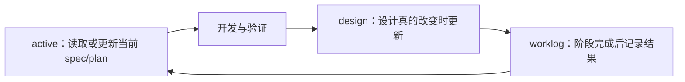

# 可组合 Agent 工作流

[English](agent-workflow.md) | 中文

本文定义一套可公开、可组合的 Agent 工作流，把小而通用的公共核心与用户选择的主机和 Workspace 模块分开。它是一套决策框架，不要求模型公开隐藏思维链，也不要求每次回答前进行表演式停顿。

## 目标

- 保留用户真正的目标、授权边界和验收界面。
- 交付有证据的最简单完整方案，而不是最快给出貌似可行的回答。
- 让公共核心足够小，在不同语言、主机、工具和开发领域中都能成立。
- 只有用户理解影响和成本并选择后，才加入语言、工具、主机、实验、文档或领域行为。

## 行动前判断

开始非平凡操作前，Agent 应在内部回答：

1. 用户真正想得到什么结果，应该从哪个真实界面或信号验收？
2. 哪些是已确认事实，哪些是合理推测，哪些仍是未验证假设？
3. 需求是否存在错误前提、信息缺失、隐藏风险，或者成本更低的等价路径？
4. 按第一性原理，哪些约束和不变量确实必要？
5. 按奥卡姆剃刀，什么方案能以最少的状态、依赖和维护责任满足需求？
6. 按苏格拉底提问，什么反例、失败模式或替代方案会改变当前决策？

只有未决信息会实质影响架构、数据、权限、安全、兼容性、用户可见行为或授权时，才向用户提问。否则先检查现有证据，必要时说明低风险假设，然后继续。

“回答前停顿一下”应转化为上述内部检查，而不是增加固定等待时间或输出冗长推理过程。

## 指令分层

每一层只保存适合自己的内容：

- 全局 `~/.codex/AGENTS.md`：最小公共核心，加上这台主机明确选择的语言、报告、工具、平台和主机模块。
- 仓库或子目录 `AGENTS.md`：长期有效的团队与代码库规则、命令、边界，以及 `active/`、`design/`、`worklog/` 的入口。
- 项目 `docs/`：`active/` 放当前 spec/plan，`design/` 放稳定算法与技术设计，`worklog/` 放完成阶段的记录。
- Skills：需要丰富说明、scripts、references、assets 或检查器的可重复流程。
- Memories 与会话索引：本机私有上下文。应提炼或建立索引，不把原始历史复制到公开仓库。

保持 `AGENTS.md` 小而稳定。规则应该因为长期、反复适用而进入其中，而不是因为它在某一次任务中很重要。Codex 官方定制说明也把 `AGENTS.md`、memories、Skills、MCP 和 subagents 视为互补层，而不是互相替代：<https://learn.chatgpt.com/docs/customization/overview>。

## 两条独立部署路径

| 部署 | 负责 | 不应负责 |
| --- | --- | --- |
| 主机全局 `AGENTS.md` | 最小公共行为和明确选择的主机偏好 | 项目状态、项目路径、session 历史、领域规则 |
| Workspace 模块 | 持续文档、实验记录、Robotics 证据等选中的项目工作流 | 个人沟通偏好、主机 Shell 和工具规则 |

两条路径必须都能独立使用，并拥有各自的预览、批准、更新和移除过程。推荐同时部署，因为它们解决互补问题；但不能通过在两层复制规则来实现“绑定”：全局指令管理行为，项目指令只负责告诉 Agent 去哪里读取当前计划、设计和工作记录。

主机规则的含义、代价和选择边界见[主机全局 AGENTS 逐条解读](global-agents.zh-CN.md)；可选三目录流程的实际使用方法见[Workspace 持续文档工作流](workspace-continuous-documentation.zh-CN.md)。

### 选择模块，而不是默认继承

跨平台核心不携带个人语言、worktree、subagent、RTK、时区、操作系统、资源或领域策略。安装时，Agent 先检查主机和现有规则，排除不相关模块，再解释剩余选项，让用户选择。

- 环境检测只证明模块相关，不代表用户批准。例如 Windows native 说明 `templates/platform/windows-shell.md` 值得推荐，但仍要等用户确认 diff 后才合并。
- 明显不相关的模块不要拿来逐项提问。主机里存在 Robotics 仓库，不代表普通 Web workspace 也需要 Robotics 规则。
- 一个选项不能自动推导另一个。选择中文不等于选择 RTK；选择持续文档也不等于选择实验或 Robotics 规则。
- 已选模块只能出现一次；时区等参数化模块不得保留未替换占位符。

机器路径、版本快照、凭据、session 状态和主机清单不得进入公开模块。

## 公共核心与可选默认值

最小核心只保留在大多数开发场景都成立的行为：独立判断、授权与秘密边界、聚焦实现、证据驱动调试、兼容性决策、风险成比例验证和坦诚汇报。

以下内容属于显式选项，不是通用默认值：

- 对话语言和 English 技术标识的处理方式；
- 单 Agent 工作及 subagent 上下文限制；
- 固定在当前 checkout、不使用 Git worktree；
- 可选 `rtk` 过滤；
- 工作记录使用的时区；
- 更严格的 Git 仓库或持久化数据保护；
- 平台 Shell 行为与主机资源限制；
- Workspace 内的持续文档、实验纪律和 Robotics 验证。

选项目录位于 [templates/optional/](../templates/optional/)，平台选项位于 [templates/platform/](../templates/platform/)，项目选项位于 [templates/workspace/](../templates/workspace/)。部署 Agent 应只推荐少量相关模块，用通俗语言解释行为和取舍，并通过拟议 diff 获得用户批准。

## 兼容性必须经过决策

不要条件反射式保留兼容，也不要条件反射式破坏兼容。

| 场景 | 默认方向 | 需要确认的证据 |
| --- | --- | --- |
| 个人科研、原型、未发布实验 | 倾向直接迁移并移除旧路径 | 现有消费者、复现实验需求、回滚成本 |
| 实验室公共基础设施、多人工具、公开包、工业或生产系统 | 倾向有边界的兼容或迁移方案 | 支持版本、下游用户、弃用周期、回滚与可观测性 |
| 场景不明确，或选择会改变架构与用户行为 | 询问开发者 | 具体消费者、必须维持的契约、可接受的破坏范围 |

必须兼容时，优先给出明确的版本边界、迁移路径和移除条件，避免永久 fallback 与静默双行为。

## 实现纪律

- 选择能完整满足当前需求的最简单实现。“简单”指更少的状态、依赖、故障模式与维护责任，不只是 diff 更小。
- 遇到非显然问题时，先用证据定位被破坏的责任、约束、不变量或数据流，再选择修复方案；用最小精确修改恢复正确模型，不为保持小 diff 叠加临时补丁。
- 在已工作的系统上逐层增长。每层先端到端验证，再增加下一项能力。
- 保持关注点分离，但不要添加推测性的抽象、配置或扩展点。
- 保护无关工作；每个修改文件和修改行都应能追溯到需求或当前变更引发的必要修复。
- 生产代码中不保留 debug 产物、死代码、过期分支和任务临时文件。
- 倾向长期可靠的架构选择，但不要在当前验收标准达成前建设想象中的未来。

## 风险成比例的三角验证

代码或配置改动应从三个互补角度寻找证据：

1. 预期行为：目标路径在真实验收面上工作。
2. 边界行为：覆盖一个相关边界、失败或回归路径。
3. 独立证据：测试、静态分析、diff/config 检查、日志、构建输出或真实界面复核与结论相互印证。

三角验证不能妨碍敏捷开发。它不是强制运行三套测试，也不是每改一个变量都启动全量 CI：

- 低风险、局部改动：一次快速定向检查可以同时覆盖多个角度，再补一次 diff/config 复核即可。
- 中等风险改动：运行直接相关测试，加一项边界或静态检查。
- 核心流程、共享模块、权限、安全、数据或用户界面改动：扩大到真实界面、集成路径和回滚验证。

不要为了凑满“三次”运行低信号测试。某一角度不适用或环境不允许时，说明原因即可。同一问题经过三次有意义的修复与验证仍未解决时，停止继续修改代码，转而审查架构、数据流、依赖和失败边界。

## 可选的 Workspace 三目录文档流

Workspace 所有者确认采用持续文档、且项目确实需要跨会话恢复时，只维护三类文档：

- `docs/active/` 保存当前正在推进的 spec 或 plan，包括目标、范围、完成标准、进度和下一步。
- `docs/design/` 保存长期有效的算法、接口、架构和安全设计，不记录每日进度。
- `docs/worklog/` 使用统一模板记录一个完成阶段的背景、工作内容、结果、证据、问题与下一步，不写成命令流水账。
- 较大任务开始前读取相关 active 文档，改算法或接口前读取相关 design 文档；小改动不强制创建计划或 worklog。
- 任务结束后，让 design 接住长期设计、worklog 接住实际结果，再把已完成计划移出 active。项目有 archive 就沿用，没有则不额外创建一套。
- 项目 `AGENTS.md` 只保存稳定规则和三个目录的入口，不保存当前任务进度。
- 未经授权不得删除用户原有文档或历史；只清理由当前任务创建且已确认不再需要的草稿。

## Skill 打包门槛

流程能写成 Skill，不代表应该立刻写成 Skill。只有同时满足以下条件才打包：

- 触发条件和预期输出稳定；
- 会跨任务或跨项目重复；
- 渐进加载确有价值；
- scripts、references、assets 或自动检查能带来实际收益；
- 安装、更新和生成状态的成本低于流程节省的成本。

meta-skill 或 Skill 框架可以帮助编写与评测，但它自己的 benchmark 只能作为候选证据。安装前应检查代码、依赖、生成文件、上下文占用和可复现性。

## 更新本工作流

只有出现反复反馈、已纠正假设、重复故障或已验证的工具/平台变化时，才修改稳定规则。广泛适用的行为进入核心；用户、工具、主机、平台和领域选择进入具名模块。一次性偏好和机器状态不进入公开规范。中英文语义发生变化时，应在同一次修改中同步更新。
